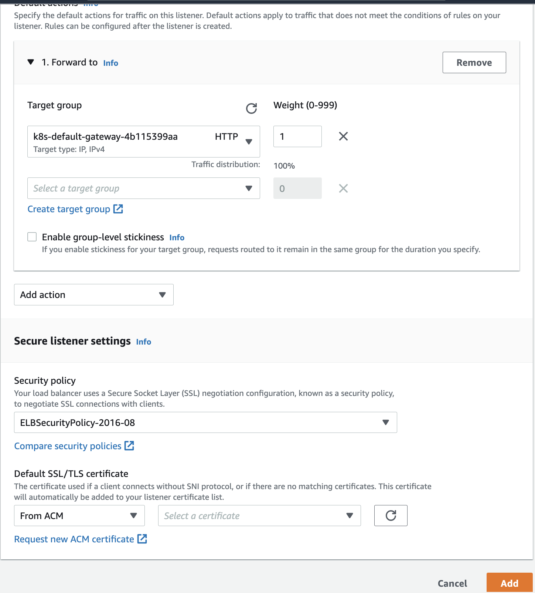

# Terraform


## Run Terraform
Run the following commands to provision all the infrastructure:

```
terraform play
terrafrom apply
```

# Adding HTTPS for Ingress Resources

## Manual Process
Follow the steps to add HTTPS to ingress resources:
1. Add a HTTPS listener to the coresponding ALB
2. Forward the rule to the assocated target group
3. Associate the ACM certificate to the listener



## Via Terraform
Follow the steps to add HTTPS to ingress resources:
1. Define the values for three variables certificate_arn, ingress_names and ingress_alb.
- certificate_arn: ARN of the ACM certiticate used for HTTPS request
- ingress_names: List of Ingress rules along with service name, port and backend path
- ingress_alb: list of Listeners pointing to the coresponding Target Group
2. Run the Terraform code, with the following command:
```
terraform apply
```

